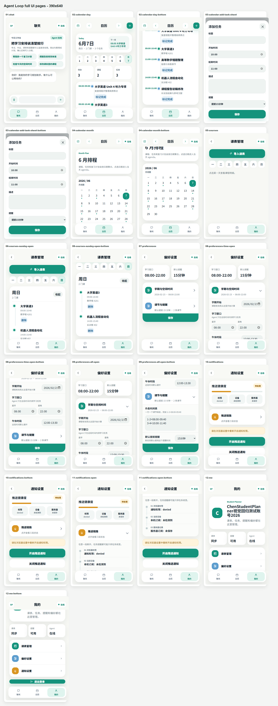
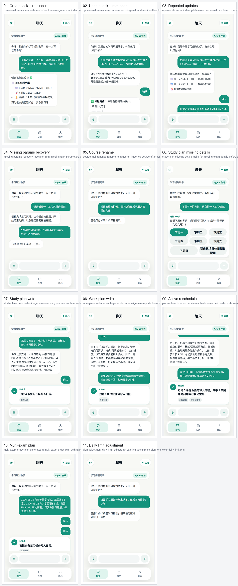

# Student Planner Agent

一个面向大学生日常使用场景的 AI 时间规划项目。它把课程表、任务、提醒和聊天式规划放在同一个产品里，重点不是“单纯聊天”，而是让助手能基于真实日程数据做可确认、可执行的安排。

## 项目亮点

- 聊天式规划助手：支持通过自然语言查看课表、安排任务、生成复习计划、设置提醒。
- ReAct 风格 Agent 工具编排：助手不是只输出文本，而是会在对话中选择工具、读取工具结果、继续决策，并通过确认卡控制写入动作。
- 期末作业框架版：在稳定 Agent 闭环外新增 LangChain / LangGraph / RAG 运行时，满足课程对框架和检索增强的要求。
- 课表导入链路：支持 Excel 课表导入，也支持课表截图识别后的结构化确认导入。
- 移动端 PWA：提供适合手机使用的聊天、日历、课程与通知体验。
- 提醒系统：支持 Web Push 推送与服务端定时调度。

## 当前体验快照

下面两张图来自最新一轮移动端全页面截图与 Agent Loop live E2E 视觉回归。





## Agent 架构定位

当前 Agent 为 **ReAct / function calling 执行闭环**

它的基本流程是：

```text
用户输入 -> 模型判断下一步 -> tool_call(Action) -> 后端执行 -> tool_result(Observation) -> 模型继续判断 -> 最终回复
```

- Thought：由模型内部完成，不在前端展示，也不把推理过程持久化。
- Action：模型通过 function calling 选择工具，例如 `list_tasks`、`ask_user`、`create_task`、`update_task`。
- Observation：后端执行工具后把 `tool_result` 回填到模型上下文，供下一轮决策使用。
- Final：当模型不再调用工具时，返回普通 assistant 文本给用户。

项目中也有一个具体的复习计划生成工具 `create_study_plan`，但它只负责根据考试和空闲时间生成候选计划；真正写入日程仍然需要用户确认后逐条调用 `create_task`。因此更准确的项目表述是：**基于 ReAct 思路的工具调用 Agent，围绕学生日程场景做了确认、校验、落库和提醒闭环**。


最新验证结果：

- 后端核心回归：`54 passed`
- 前端 `typecheck`：PASS
- 前端生产构建：PASS
- 真实百炼 Embedding smoke：`embedding_provider=dashscope`，`embedding_model=text-embedding-v4`，`fallback_reason=none`
- 扩展公开语料导入：`scripts/import_public_rag_sources.py --preset expanded --limit 80 --max-chars 18000 --skip-existing`，实际导入 `74/80` 个公开条目，失败项记录在 `student-planner/data/rag/public/PUBLIC_SOURCES.json`。
- 大语料 RAG quality：`300 queries / 6 scenarios / 50 each`，`Recall@5=100%`，`Top1 source hit=93.33%`，严格术语通过率 `92.00%`，`chunk_count=2472`，`chunk_overlap=150`，`embedding_provider=dashscope`，`vector_store_provider=chroma`，首次构建 `vector_store_hits=0 / misses=2472`。构建后清进程缓存复查为 `vector_store_hits=2472 / misses=0`。汇总报告位于 `student-planner/data/rag/RAG_QUALITY_300.json`，完整 300 条明细位于 `student-planner/data/rag/RAG_QUALITY_300_DETAILS.json`，可读召回样例位于 `student-planner/data/rag/RAG_QUALITY_SAMPLE_QA.md`，最终回答 result 样例位于 `student-planner/data/rag/RAG_RESULT_SAMPLE_ANSWERS.md`
- 浏览器 RAG smoke：`1 passed`，证据位于 `output/playwright/agent-loop-e2e-langgraph-rag-smoke-emits-LangGraph-RAG-retrieval-events-before-model-delegation.json`
- 真实模型 + 浏览器复习计划写入 E2E：`1 passed`，`plan_write.created_count=19 / failed_count=0`

## 技术栈

- Backend: FastAPI, SQLAlchemy Async, Alembic, APScheduler
- Agent: LangChain, LangGraph, RAG, Alibaba Cloud Bailian/DashScope embedding, OpenAI-compatible LLM client, ReAct-style tool calling loop, guardrails, schema preflight
- Frontend: React 18, TypeScript, Zustand, Vite, vite-plugin-pwa
- Testing: pytest, Vitest, Playwright

## 这个仓库里有什么

- [student-planner](./student-planner): 实际项目源码，包含前后端、Agent、数据库迁移和测试。
- [docs/superpowers](./docs/superpowers): 设计文档与阶段计划，记录了项目从基础能力到移动端内测的演进过程。
- [AGENTS.md](./AGENTS.md), [progress.md](./progress.md), [bugs.md](./bugs.md): 开发过程中的协作文档和交接记录。它们不是产品文档，而是项目迭代过程的一部分。

## 推荐阅读顺序

1. [student-planner/README.md](./student-planner/README.md): 看完整项目说明、运行方式和目录结构。
2. [student-planner/app](./student-planner/app): 看后端与 Agent 主体实现。
3. [student-planner/frontend/src](./student-planner/frontend/src): 看前端页面、状态管理和 PWA 入口。
4. [student-planner/tests](./student-planner/tests): 看自动化测试覆盖的核心链路。


## 说明

- 当前仓库展示的是持续迭代中的版本，因此会看到设计文档、计划文档和测试文件一起保留。
- 如果你只想快速理解项目，优先看上面的源码与 README，不需要先看内部协作文档。
