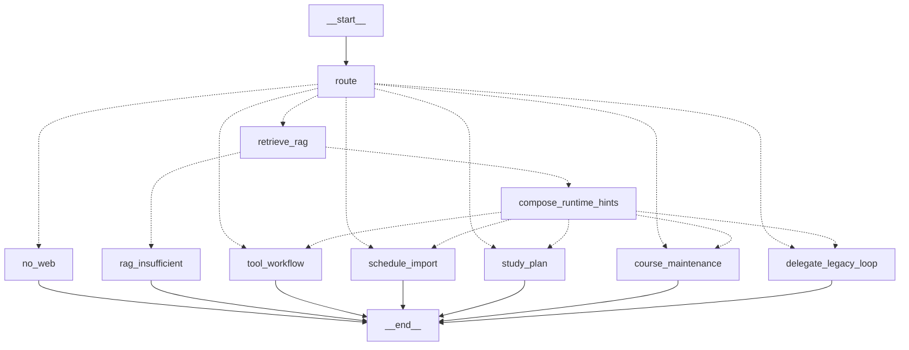

# LangGraph Migration Contracts

This is the pre-migration contract for replacing the legacy `run_agent_loop()` with a LangGraph-native loop later. It is not a full migration plan and it must not change the current product behavior by itself.

## Architecture Boundary

LangGraph should own orchestration: route selection, state transitions, loop limits, confirmation pauses, tool execution ordering, and event emission order. LangChain chains or Runnables are still useful inside graph nodes for local LLM work, prompt formatting, parsing, retrieval, and tool-bound model calls. The graph is the control plane; chains are node implementation details.

The current runtime is still partial, but the action golden paths now enter explicit
LangGraph action-route terminals instead of the generic legacy-delegate node:

1. `chat.py` chooses `run_langgraph_agent_loop` when `SP_AGENT_RUNTIME=langgraph`.
2. `langgraph_loop.py` exposes a Router Shell V2 graph with `route`, `no_web`, `retrieve_rag`, `compose_runtime_hints`, `rag_insufficient`, `tool_workflow`, `schedule_import`, `study_plan`, `course_maintenance`, and `delegate_legacy_loop` nodes.
3. `route` conditionally sends no-web requests directly to the no-web terminal response, sends RAG/context candidates through retrieval, and sends native action routes to their corresponding action nodes.
4. `retrieve_rag` conditionally sends insufficient gated RAG QA to `rag_insufficient`; non-gated RAG side-channel paths continue through hints and then to the selected action node or legacy fallback.
5. `run_langgraph_agent_loop()` dispatches `tool_workflow`, `schedule_import`, `study_plan`, and `course_maintenance` through `run_agent_action_loop()`, preserving the existing WebSocket event protocol, `ask_user` pause/resume, preflight, and confirmation write gate without appending `delegate_legacy_loop` to `graph_nodes`.
6. `delegate_legacy_loop` remains for non-action fallback paths such as plain chat, but golden action workflows must not trace through it.

## Router Contract

Priority is part of the contract. Later graph edges must keep this order. RAG retrieval is also a context side-channel: messages that match local study-material keywords may retrieve RAG context before the final route runs, but only `should_gate_rag_answer=true` routes are allowed to stop as `rag_insufficient`.

1. `no_web`: current public/news/realtime requests. Next step: return the no-web text and `done`; do not call RAG, tools, or ordinary LLM.
2. `rag_qa`: local knowledge-answer candidate with sufficient or not-yet-retrieved evidence. Next step: retrieve local study material, inject runtime hints, answer only from local context.
3. `rag_insufficient`: local knowledge-answer candidate after retrieval but local evidence is insufficient. Next step: return the fixed insufficient-knowledge-base text and `done`; do not delegate to ordinary LLM.
4. `schedule_import`: upload or `file_id` based timetable import. Next step: parse schedule, ask for missing period/semester data if needed, ask for final import confirmation, then write.
5. `course_maintenance`: course rename, merge, delete, or correction. Next step: list/disambiguate courses, ask for confirmation, then update/delete.
6. `study_plan`: study/work plan generation. Next step: keep any RAG context retrieval as non-gating context, collect study/work context when needed, get free slots, generate candidate plan, ask for review, then write tasks only after confirmation.
7. `tool_workflow`: task, reminder, schedule, and other action workflows. Next step: keep any RAG context retrieval as non-gating context, then run the guarded tool loop.
8. `plain_chat`: no tool/RAG route. Next step: text-only LLM response within normal no-web constraints.

`decide_agent_route()` in `contracts.py` is the executable anchor for this priority. It is intentionally conservative and does not execute tools or call a model.

Router Shell V2 graph shape:

## State Schema

A LangGraph-native state must include at least:

- `route`: selected `AgentRoute`.
- `should_retrieve`: whether the current message should retrieve local RAG context before the final route executes.
- `should_gate_rag_answer`: whether insufficient RAG evidence must stop the turn instead of delegating to the tool/plain loop.
- `retrieval_mode`: `local_rag_context` for the current RAG side-channel, otherwise `none`.
- `messages`: LLM-visible conversation and tool messages.
- `runtime_hints`: system hints such as RAG context.
- `rag_result`: retrieval result and evidence metadata.
- `pending_confirmation`: active `ask_user` request and data required to resume.
- `tool_history`: ordered tool names used for loop guardrails and stream mode decisions.
- `preflight_reference_texts`: user and confirmed question text used for reminder/context argument repair.
- `preflight_user_texts`: user-provided text used for tool intent and task preflight decisions.
- `error_count`: per-tool retry counts.
- `last_tool_result`: last raw result from `execute_tool`.
- `last_free_slots_result`: free-slot result reused by study/work plan generation.
- `review_data`: candidate plan, parsed schedule, or course disambiguation payload shown to the user.
- `db_write_plan`: intended write operation awaiting confirmation.
- `stream_state`: message id, buffered deltas, and whether text deltas were emitted.
- `step`: persisted agent-log step counter.
- `pending_tool_call`: the current OpenAI-style tool call being executed by the graph-native tool node.
- `initial_study_context_text`: early study-context intake answer that must feed later plan preflight.
- `graph_nodes`, `uses_langgraph`, `uses_langchain_tools`: runtime trace fields used by current LangGraph/RAG evidence events.

Runtime dependencies such as `user`, `session_id`, `db`, and `llm_client` may live in graph config/context instead of the serializable state, but every node that writes, logs, or calls a model needs access to them.

## Event Contract

Agent events are JSON objects sent through the WebSocket after the `connected` handshake.

- `text_delta`: `{type, message_id, delta}`. Only emitted for text-only streaming or replayed buffered deltas after a non-tool final response.
- `text`: `{type, message_id, content}`. Final assistant text for a turn or direct guard/gate response.
- `tool_call`: `{type, name, args}`. Must precede the matching `tool_result`, except `ask_user` emits a pause event instead of a normal tool result.
- `tool_result`: `{type, name, result}`. Emitted after non-`ask_user` tool execution.
- `ask_user`: `{type, question, ask_type, options?, data?}`. Pauses the generator and resumes with the submitted answer.
- `result`: `{type, message_id, content, tone?, eyebrow?, title?, chips?, data?}`. Structured assistant result used by review override and rich result surfaces.
- `done`: `{type}`. Exactly one terminal success event after text/tool workflow completion.
- `error`: `{type, message}`. User-visible runtime or guardrail error. Agent-generator terminal errors should be followed by `done`; WebSocket-wrapper exceptions are currently standalone `error` events.

Allowed direct guard/gate sequences:

- no-web: `text -> done`.
- RAG insufficient: `tool_call(rag_retrieve_study_materials) -> tool_result -> text -> done`.
- RAG hit: `tool_call(rag_retrieve_study_materials) -> tool_result -> inner loop events -> done`.

## Confirmation Contract

Database writes and scheduler side effects require code-level confirmation as the migration target. Prompt instructions alone are not sufficient.

Tools that must be behind `ask_user` before their write effect:

- Course writes: `add_course`, `update_course`, `delete_course`, `bulk_import_courses`.
- Task writes: `create_task`, `update_task`, `complete_task`.
- Reminder writes: `set_reminder`.
- Schedule import metadata writes: `save_period_times`.
- Memory writes: `save_memory`, `delete_memory`.

Plan generators `create_study_plan` and `create_work_plan` create candidate task data only. The generated tasks must go through a review `ask_user` before any `create_task` calls. A cancel response must return a short text response plus `done` and must not write.

Confirmation State V1 now has a shared agent-loop DB write gate. Schedule import builds a `PendingConfirmation` and `DBWritePlan` before showing the final parsed-course review card, and `bulk_import_courses` is called only through `_execute_confirmed_db_write_plan()` after the submitted answer confirms the same confirmation id, route, and tool scope. The same helper now gates confirmed task writes (`create_task`, `update_task`, `set_reminder` through the generic tool loop and local task shortcuts), course maintenance writes (`update_course`, `delete_course`), and study/work-plan task writes. Cancel and negative answers return `text -> done` without executing the write plan.

Current remaining legacy caveat: `execute_tool` is still a direct dispatcher for non-agent callers and direct tool tests. The gate is enforced in the agent loop before write tools execute, not in HTTP routers or the low-level dispatcher. A later LangGraph-native tool node must preserve this `pending_confirmation/db_write_plan` state and should keep `save_period_times` semantics explicit if schedule metadata collection is moved out of the legacy shortcut.

## Tool Boundary

The graph-native tool node must preserve the current boundary:

1. `check_unknown_tool`.
2. `check_consecutive_ask_user`.
3. `check_max_retries`.
4. `task_tool_preflight_error`.
5. Context preflight for study/work plans.
6. `tool_schema_preflight_error`.
7. `apply_tool_preflight` for confirmed reminder slots.
8. `execute_tool`.
9. `tool_result` event for non-`ask_user` tools.
10. Persist compressed tool summary when applicable.
11. Persist agent log step.
12. Append tool message for the model.
13. Update `tool_history` and `error_count`.

Current migration status: `run_langgraph_tool_node()` provides an independently testable node-level harness for one pending tool call. It owns guardrails, schema/task preflight, reminder argument repair, execution dispatch, tool-result events, compressed tool summary persistence, agent-log persistence, tool messages, `tool_history`, `error_count`, and `last_tool_result` updates through graph state. Full streaming action-route orchestration now enters LangGraph action nodes and calls the shared guarded `run_agent_action_loop()` helper instead of `delegate_legacy_loop`; future graph-native loop work can decompose that helper into finer graph nodes and should reuse `run_langgraph_tool_node()` instead of calling `execute_tool()` directly for agent tool execution.

## Streaming Strategy

These modes must be preserved:

- `text_only_stream`: no tool intent. Forward `content_delta` as `text_delta`, then emit final `text` and `done`.
- `tool_call_preamble_buffer`: tool-capable stream. Buffer model text while waiting for the final response; if the response contains tool calls, do not emit the preamble as user-visible text.
- `rag_retrieve_then_inner_stream`: LangGraph wrapper emits RAG tool events, then delegates to the inner loop stream.
- `rag_insufficient_text_done`: after RAG retrieval, emit fixed insufficient-evidence text and stop.
- `no_web_text_done`: skip retrieval/model/tool execution and emit the no-web text directly.
- `structured_result`: emit `result` for structured review/write summaries, then `done`.

## Golden E2E Matrix

These scenarios must stay green during a full LangGraph migration:

- RAG hit: local study-material question retrieves evidence and answers from local context.
- RAG insufficient: local knowledge-answer candidate with weak evidence does not call ordinary LLM.
- no-web: current public event/news question is blocked before RAG/LLM.
- create task confirmed: `ask_user` confirmation precedes `create_task` DB write.
- study plan confirmed write: candidate plan is reviewed before generated tasks are persisted.
- schedule import confirmed: parsed timetable is reviewed before `bulk_import_courses`.
- reminder set: reminder side effects follow confirmation and emit tool result.
- ask_user multiturn: generator pauses and resumes with the user's answer.
- tool failure recovery: tool errors increment retry state and remain under guardrails.
- plain chat streaming: non-tool chat emits `text_delta` before final `text`.
- tool preamble buffering: pre-tool prose is not emitted when a tool call is returned.
- course maintenance confirmed: rename/delete/merge asks for confirmation before write.
- empty schedule parse: no recognized courses returns `text -> done` and does not show a confirmation card.

`GOLDEN_E2E_MATRIX` in `contracts.py` mirrors this list for tests.
